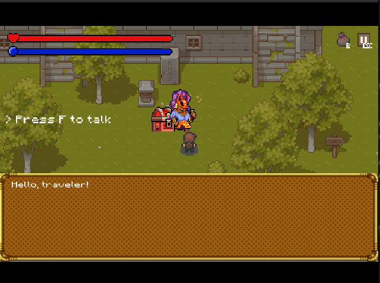
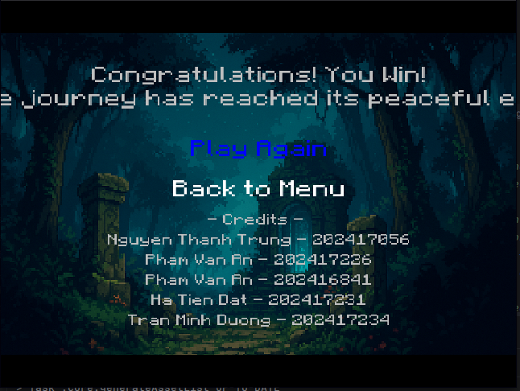

# Báo cáo chi tiết các lỗi đã sửa (Nguyễn Thành Trung)

## 1. Mục đích tài liệu

Tài liệu này tổng hợp lại các lỗi đã được ghi nhận trong `Bugs/Bugs.md`, nguyên nhân kỹ thuật gây lỗi, cách sửa đã áp dụng trong mã nguồn và kết quả mong đợi sau khi sửa.

Các nội dung được trình bày theo từng bug để dễ theo dõi và đối chiếu với mã nguồn:

1. Lỗi chuyển map từ `Map 1 -> Map 2` và `Map 2 -> Map 3`
2. Lỗi sau khi nhấn `F` để nói chuyện với NPC thì màn hình bị đơ
3. Lỗi tên danh sách thành viên ở màn hình chiến thắng

---

## 2. Lỗi chuyển map từ Map 1 -> Map 2 và Map 2 -> Map 3

### 2.1. Hiện tượng lỗi

Theo ghi nhận ban đầu:

- Khi người chơi đi vào cổng dịch chuyển của Map 1, game không sang Map 2 đúng cách mà bị quay trở lại luồng mở đầu game.
- Khi đi qua cổng dịch chuyển của Map 2, game không chuyển ổn định sang Map 3 mà có lúc quay ngược về trạng thái cũ hoặc vẫn ở map hiện tại.

Hiện tượng này làm trải nghiệm chuyển chapter bị đứt đoạn, không đồng nhất với các map sau.

### 2.2. Nguyên nhân kỹ thuật

Lỗi nằm trong logic xử lý portal của `core/src/main/java/com/paradise_seeker/game/screen/GameScreen.java`, cụ thể ở hàm `handlePortalsEvent()`.

#### 2.2.1. Nguyên nhân ở Map 1 -> Map 2

Code cũ không chỉ chuyển map mà còn thực hiện thêm các hành động thuộc luồng `New Game`:

- xóa checkpoint đang lưu
- reset toàn bộ trạng thái cốt truyện
- tạo mới lại `GameScreen`
- mở lại `IntroCutScene`

Điều này khiến portal của Map 1 vô tình hoạt động như nút khởi động lại game, thay vì chỉ là bước chuyển chapter.

#### 2.2.2. Nguyên nhân ở Map 2 -> Map 3

Ở nhánh này, code cũ lại tạo mới `GameScreen` và load checkpoint ngay khi vừa chạm cổng.

Hành vi này dễ kéo người chơi về lại dữ liệu cũ, vì checkpoint có thể đang lưu trạng thái map trước đó, vị trí cũ hoặc trạng thái chưa đồng bộ. Kết quả là game không giữ được tính liên tục của phiên chơi.

### 2.3. Cách sửa đã áp dụng

Giải pháp là bỏ các thao tác mang tính “khởi động lại game” ra khỏi logic portal và thay bằng luồng chuyển chapter thống nhất với các map sau.

#### 2.3.1. Các dòng đã xóa trong nhánh Map 1 -> Map 2

```java
game.saveManager.clearCheckpoint();
game.storyState.resetFlags();
game.storyState.setCurrentRoute(com.paradise_seeker.game.story.RouteType.NORMAL);

game.currentGame = null;
game.inventoryScreen = null;
game.currentGame = new GameScreen(game);

game.setScreen(new IntroCutScene(game));
```

Ý nghĩa của phần bị xóa:

- `clearCheckpoint()` xóa toàn bộ dữ liệu lưu tạm, giống hành vi bắt đầu game mới.
- `resetFlags()` và ép route về `NORMAL` làm mất trạng thái cốt truyện hiện tại.
- Tạo lại `GameScreen` khiến runtime state bị thay thế giữa lúc chuyển map.
- `IntroCutScene` làm người chơi bị quay về đầu game thay vì sang chapter tiếp theo.

#### 2.3.2. Các dòng đã xóa trong nhánh Map 2 -> Map 3

```java
game.currentGame = null;
game.inventoryScreen = null;
game.currentGame = new GameScreen(game);

if (game.saveManager != null && game.saveManager.hasCheckpoint()) {
    game.saveManager.loadCheckpoint(game.currentGame, game);
}

game.setScreen(game.currentGame);
```

Ý nghĩa của phần bị xóa:

- Khởi tạo màn chơi mới ngay khi chạm portal làm mất continuity của màn hiện tại.
- `loadCheckpoint()` tại thời điểm này dễ nạp lại dữ liệu map cũ, gây cảm giác game bị quay ngược.
- `setScreen(game.currentGame)` khi đi kèm với việc tạo lại màn hình làm luồng chuyển map không còn liền mạch.

#### 2.3.3. Các dòng đã thêm

Ở cả hai nhánh portal, logic được thay bằng cutscene chuyển chapter:

```java
if (mapcutsceneIndicesEnd[0] == 0) {
    mapcutsceneIndicesEnd[0] = 1;
    game.setScreen(new EndMap1(game));
}
```

```java
if (mapcutsceneIndicesEnd[1] == 0) {
    mapcutsceneIndicesEnd[1] = 1;
    game.setScreen(new EndMap2(game));
}
```

Ý nghĩa:

- Mỗi cutscene chỉ được phát một lần.
- Portal không còn tự ý reset lại toàn bộ game state.
- Sau cutscene, game tiếp tục chuyển map theo luồng hiện tại thay vì quay về intro hoặc load checkpoint cũ.

### 2.4. Logic sau khi sửa

Sau khi sửa, luồng portal hoạt động theo đúng mục đích:

1. Kiểm tra điều kiện để được qua cổng.
2. Nếu đây là lần đầu đi qua chapter đó thì mở cutscene `EndMap1` hoặc `EndMap2`.
3. Tiếp tục chuyển map bằng logic hiện tại của game.
4. Lưu checkpoint mới sau khi map đã được chuyển ổn định.

### 2.5. Kết quả mong đợi

- Map 1 sang Map 2 không còn quay về màn hình mở đầu.
- Map 2 sang Map 3 không còn bị load ngược trạng thái cũ.
- Cách chuyển map đồng nhất với các đoạn sau như Map 3 -> Map 4, Map 4 -> Map 5 và Map 5 -> kết game.

### 2.6. Ghi chú thêm về ý nghĩa của logic cũ

Logic cũ không sai về mặt cú pháp. Vấn đề là nó đang đặt đúng hành động nhưng sai bối cảnh:

- `clearCheckpoint()` phù hợp cho `New Game`, không phù hợp cho portal.
- `loadCheckpoint()` phù hợp cho `Continue`, không phù hợp khi vừa bước qua cổng.
- `IntroCutScene` phù hợp cho mở đầu game, không phù hợp cho chuyển chapter.

Nói cách khác, lỗi nằm ở việc gộp nhầm 3 luồng khác nhau vào cùng một chỗ xử lý portal.

---

## 3. Lỗi nhấn F để nói chuyện với NPC thì màn hình bị đơ

### 3.1. Hiện tượng lỗi

Trong quá trình chơi, khi người chơi nhấn `F` để nói chuyện với NPC, màn hình có thể bị đứng lại hoặc cảm giác như bị khóa điều khiển.

Lỗi này được ghi nhận trên nhiều map, không chỉ một map riêng lẻ.

### 3.2. Nguyên nhân kỹ thuật

Nguyên nhân nằm ở luồng xử lý tương tác NPC trong `core/src/main/java/com/paradise_seeker/game/entity/player/input/PlayerInputHandlerManager.java`.

#### 3.2.1. Vấn đề chính

Hàm `handleNPCInteraction(...)` chỉ làm nhiệm vụ:

- tìm NPC gần nhất
- bật trạng thái nói chuyện
- bật cờ `showDialogueOptions`

Nhưng phần xử lý tiếp theo của hội thoại lại nằm trong `handleDialogue(...)`.

Trước khi sửa, `handleDialogue(...)` không được gọi đúng thời điểm trong vòng lặp render của game. Điều này khiến NPC đã vào trạng thái thoại nhưng không có bước tiến hội thoại, dẫn đến cảm giác game bị treo.

#### 3.2.2. Tác động của trạng thái thoại

Khi `showDialogueOptions` bật lên, `GameScreen.render()` sẽ rơi vào nhánh trạng thái thoại và không còn xử lý gameplay bình thường như trước.

Nếu không có logic gọi `handleDialogue(...)`, trạng thái này không được thoát ra, nên người chơi thấy màn hình đứng im.

### 3.3. Cách sửa đã áp dụng

Giải pháp là giữ nguyên kiến trúc hiện tại nhưng thêm đúng bước điều phối hội thoại vào `GameScreen.render()`.

#### 3.3.1. Dòng đã thêm

Trong `core/src/main/java/com/paradise_seeker/game/screen/GameScreen.java`, sau khi tìm NPC gần nhất, thêm:

```java
player.inputHandler.handleDialogue(this, player);
```

Ý nghĩa của thay đổi này:

- Khi người chơi nhấn `F`, game không chỉ bật trạng thái bắt đầu nói chuyện mà còn gọi tiếp luồng xử lý thoại.
- Các bước hiển thị dòng đầu, chuyển sang dòng tiếp theo và kết thúc hội thoại sẽ được chạy đúng thời điểm.
- Sau khi thoại kết thúc, NPC có thể mở rương và giải phóng trạng thái cho gameplay bình thường.

### 3.4. Logic sau khi sửa

Luồng tương tác NPC giờ sẽ đi theo thứ tự:

1. Người chơi đứng gần NPC.
2. HUD hiển thị gợi ý nhấn `F`.
3. Người chơi nhấn `F`.
4. NPC được đưa vào trạng thái nói chuyện.
5. `handleDialogue(...)` được gọi để:
   - hiện dòng thoại đầu,
   - chuyển dòng tiếp theo,
   - kết thúc hội thoại.
6. NPC thoát khỏi trạng thái thoại, không còn khóa màn hình.

### 3.5. Kết quả mong đợi

- Không còn tình trạng bấm `F` rồi đứng hình.
- Hội thoại NPC được chạy tuần tự và có điểm kết thúc rõ ràng.
- Logic tương tác giữa NPC, rương và thoại không còn bị kẹt ở trạng thái trung gian.

### 3.6. Ghi chú kỹ thuật

Bug này không phải do phím `F` hỏng, mà do phím `F` đang dùng chung cho nhiều loại tương tác. Vì vậy, điều quan trọng là phải có đúng bộ điều phối trạng thái cho từng ngữ cảnh.

Nếu sau này cần tối ưu thêm, có thể tiếp tục chuẩn hóa `interactionType` trong `InteractionState` để phân biệt rõ đang tương tác với NPC, sách hay rương.

---

## 4. Lỗi hiển thị tên danh sách thành viên ở màn hình chiến thắng

### 4.1. Vị trí sửa

Phần này nằm trong `core/src/main/java/com/paradise_seeker/game/screen/WinScreen.java`, tại mảng `members` dùng để hiển thị tên thành viên ở màn hình chiến thắng.

### 4.2. Nội dung sau khi fix

```java
String[] members = {
    "Nguyen Thanh Trung - 202417056", "Pham Van An - 202417226", "Pham Van An - 202416841",
    "Ha Tien Dat - 202417231", "Tran Minh Duong - 202417234"
};
```

### 4.3. Mục đích của thay đổi

- Hiển thị đúng danh sách thành viên theo yêu cầu báo cáo.
- Hiển thị thông tin rõ ràng hơn trên màn hình chiến thắng.

### 4.4. Kết quả mong đợi

- Màn hình chiến thắng hiển thị đúng tên và mã số sinh viên đã cập nhật.

-
---

## 5. Kết luận

Sau khi sửa, các lỗi chính của game đã được xử lý theo hướng ổn định hơn:

- Chuyển map không còn nhảy về intro hoặc load ngược checkpoint cũ.
- Nhấn `F` để nói chuyện với NPC không còn làm màn hình bị đơ.
- Lỗi hiển thị danh sách tên thành viên đã được fix.

Tổng thể, các thay đổi này giúp luồng chơi mượt hơn, trạng thái game rõ ràng hơn và giảm nguy cơ xung đột giữa các chức năng dùng chung phím `F`.

---

*Cập nhật: 21/04/2026*
